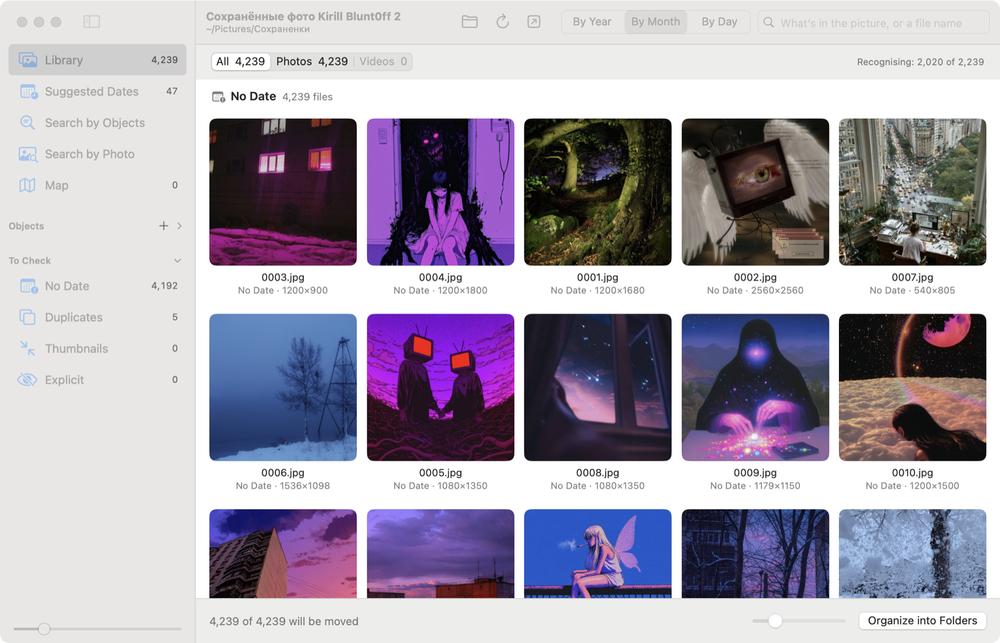

# Photo Organizer

**Sort a messy folder of photos and videos into folders by the real capture date — on your Mac or Windows PC, with
nothing uploaded.**

Photo Organizer is a small native app for macOS (Objective-C / AppKit) and Windows (C# / WPF) for the folder everyone
has: a phone backup, a Google Takeout export, years of “Camera Uploads”. It finds out when every photo and video was
really taken, shows the library the way Apple Photos does, finds duplicates and thumbnails, recognises objects and
people, and — when you ask — moves the files into `2016/`, `2016/07 July/` or `2016-07-14/` folders. Files are
**moved, never copied, renamed or re-encoded**, nothing is ever overwritten, and every move can be undone.

Both versions have the same window, the same date rules, the same folders and the same models. Everything runs
locally. No cloud, no account, no subscription.

[Русская версия ↓](#русский)

<p align="center">
  
</p>

## Download

Get the latest build from [Releases](../../releases) — every change to `main` is built and published automatically.

| | macOS | Windows |
|---|---|---|
| File | `PhotoOrganizer-x.y.z.zip` | `PhotoOrganizer-Windows-x.y.z.zip` |
| System | macOS 12 Monterey or later, Apple Silicon or Intel | Windows 10 or 11, 64-bit |
| Install | unzip, drag `PhotoOrganizer.app` to *Applications* | unzip anywhere, run `PhotoOrganizer.exe` — nothing to install |
| Recognition | Vision and Core ML; MLX on Apple Silicon | ONNX Runtime on the graphics card (DirectML, any DirectX 12 card) or the processor |

**macOS:** the build is not notarized yet, so macOS says it “could not verify” the app. Remove the quarantine flag and
launch it:

```bash
xattr -dr com.apple.quarantine /Applications/PhotoOrganizer.app
open /Applications/PhotoOrganizer.app
```

Or: *System Settings → Privacy & Security* → **Open Anyway** (on macOS 15 “right-click → Open” no longer works).

On a Mac, People and the MLX models need Apple Silicon and Python 3.10+ (or [uv](https://github.com/astral-sh/uv)); the
app sets up its own environment and downloads the models when you turn the feature on in *Settings*. On Windows the
models are downloaded the same way, nothing else is needed.

**Windows:** the exe is not signed yet; if SmartScreen stops it, choose **More info → Run anyway**.

## Features

- **Organize by date** — by year (default), month or day, with your own folder names and a preview of the result
  where every folder can be renamed before anything moves.
  - Files are moved with an atomic “never replace” rename: a name clash gets a new name, nothing is overwritten.
  - A progress bar, a journal of every move, and **Undo** that puts every file back.
- **The real capture date**, not the date the file was copied:
  - EXIF for photos; QuickTime / MP4 metadata for videos (with the 1904 / 1970 epoch bugs of some cameras fixed);
  - a date in the file name (`IMG_20160714_…`, `20220909_145141.mp4`, `IMG-20160714-WA0001`, `Screenshot 2019-07-14…`);
  - Google Takeout `.json` files next to the media;
  - copies of the same shot, and neighbouring frames of the same numbered series.
  - Files with no reliable date are **not guessed into a year**: they go to **No Date**, and **Suggested Dates**
    groups them by rule (“from the folder name *Photos from 2016*”, “like the neighbouring files IMG_0541 and IMG_0543”) with one
    *Confirm* button per rule. Any date can also be set by hand.
- **Big libraries** — a scan that is interrupted (the app closed, the computer turned off) goes on where it stopped at
  the next launch, and a rescan reads only new and changed files; the same goes for recognition.
- **A library like Apple Photos** — a grid by year, month or day, a year strip on the right to jump through time,
  a built-in viewer for photos and videos with zoom, a **map** of photos with GPS, and *Show in Library* from any
  search result.
- **Duplicates and thumbnails** — exact copies, resized and recompressed versions; *Remove Duplicates* keeps the
  best-quality file of each set and moves the rest to the Trash / Recycle Bin.
- **Search**
  - **by text**: what’s in the picture or a file name;
  - **by photo**: drop a picture and get the visually similar ones;
  - **by object**: drop a photo, draw a frame around a thing (a dog, a car, a mug) and find the photos where
    *that* thing appears — by visual similarity, not by tags.
- **People** — faces are found and grouped with an ArcFace model (downloaded on demand); face thumbnails in the
  sidebar, “only photos with this person”, names you give stay.
- **Explicit content detection** (optional) — MLX or Core ML on a Mac, ONNX on Windows.
- **VK album download** — sign in to your own VK account in the app and download an album (including *Saved
  photos*) in original size, numbered in the album’s order; an interrupted download resumes where it stopped.
- Drag files out to Finder / File Explorer, adjustable sidebar and thumbnail size.
- No rescans after work: trash, move or undo, and the library updates in place — recognition results are kept per
  file, so they survive moves on the same disk.
- English and Russian interface (follows the system language), light and dark themes.

## Keyboard shortcuts

On Windows, Ctrl stands for ⌘ and Shift for ⇧.

| Keys | Action |
|---|---|
| ⌘O | Open a folder (or drop one on the window) |
| ⌘↩ | Organize into folders… |
| ⌘F / ⇧⌘F | Search / Search by photo |
| ⌘↓ / ⌘↑ | Open in the viewer / back to the grid |
| ⌘⌫ | Move to Trash |
| ⇧⌘M | Move what is shown to a folder… |
| ⌘Z / ⇧⌘Z | Undo / Redo |
| ⌘+ / ⌘− / ⌘0 / ⌘9 | Zoom in / out / actual size / fit (viewer); sidebar size (grid) |
| ⌘R / ⇧⌘R | Rescan / Show the folder in Finder |

## Build from source

**macOS** — only the Xcode Command Line Tools are needed (`xcode-select --install`):

```bash
./build.sh          # → build/PhotoOrganizer.app (universal, ad-hoc signed)
./build.sh run      # build and launch
./build.sh test     # core tests: dates, plan, duplicates, moves, undo
./build.sh zip      # → build/PhotoOrganizer-<version>.zip
./build.sh strings  # check that every Russian string has an English translation
```

**Windows** — PowerShell in the repository root; the .NET 10 SDK is installed for the current user if it is missing:

```powershell
.\build.ps1         # → build\PhotoOrganizer-Windows\PhotoOrganizer.exe (one self-contained file)
.\build.ps1 run     # build and launch
```

More about the Windows version: [WindowsApp/README.md](WindowsApp/README.md).

**Releasing**: nothing is built or uploaded by hand. Every push to `main` makes GitHub Actions run the macOS tests,
build both apps and publish them as release `v<VERSION>.<build number>` — `VERSION` in the repository root holds
the major and minor version.

### How it works

```
macOS — AppKit UI (Objective-C), Sources/
  POScanner      walks the folder, reads EXIF / QuickTime / Takeout dates, sizes, GPS; keeps what it read per file
  POPlan         dates from names, copies and neighbours; groups, duplicates, thumbnails, undated files
  PODateSuggestions  rules for undated files (folder name, file name, neighbouring files…)
  POOrganizer    safe moves (renamex_np RENAME_EXCL), journal, undo
  POAnalyzer     Vision: labels, feature prints, salient objects, faces  → cached per file
  POObjectIndex  object search: fp16 feature prints of the whole photo and up to 3 objects
  POPeople       face grouping ── vit_mlx.py (ArcFace / nudity models on MLX, one long-lived process)
  POVKAlbum      VK API: album pages → original-size downloads, 4 at a time

Windows — WPF UI (C#), WindowsApp/PhotoOrganizer/
  Core/Scanner, ScanCache   the same scan, kept per file
  Core/Plan, Organizer      the same rules and safe moves (MoveFileEx without replace)
  Core/Analyzer             MobileCLIP (labels, object vectors), YuNet + ArcFace (faces), nudity models — ONNX Runtime, DirectML
  Core/VitOnnx              turns the downloaded safetensors weights into ONNX
```

| Where | What |
|---|---|
| `~/Library/Application Support/Photo Organizer` (macOS), `%APPDATA%\Photo Organizer` (Windows) | what scans read, recognition results, object index, dates set by hand, people’s names, the move journal, the VK sign-in token (readable only by you) |
| `~/.cache/huggingface/hub` | downloaded models (the standard Hugging Face cache, shared with other apps) |

The photos and videos themselves are never modified — only moved, when you ask.

## License

MIT — see [LICENSE](LICENSE). Downloaded models keep their authors’ licenses.

---

<a id="русский"></a>

# Photo Organizer (по-русски)

**Раскладывает папку с фото и видео по папкам по настоящей дате съёмки — на Mac или на компьютере с Windows, ничего
никуда не загружая.**

Photo Organizer — небольшое нативное приложение для macOS (Objective-C / AppKit) и Windows (C# / WPF) для папки,
которая есть у всех: бэкап телефона, выгрузка Google Takeout, годы «Camera Uploads». Оно выясняет, когда на самом
деле снят каждый файл, показывает медиатеку как «Фото» от Apple, находит дубликаты и миниатюры, распознаёт объекты и
людей и — когда вы попросите — раскладывает файлы по папкам `2016/`, `2016/07 Июль/` или `2016-07-14/`. Файлы
**перемещаются, а не копируются, не переименовываются и не пережимаются**, ничего не перезаписывается, любое
перемещение можно отменить.

У обеих версий одно и то же окно, те же правила дат, те же папки и те же модели. Всё работает локально: без облака,
аккаунтов и подписок.

<p align="center">
  
</p>

## Скачать

Свежая сборка — в [Releases](../../releases): каждое изменение в `main` собирается и публикуется автоматически.

| | macOS | Windows |
|---|---|---|
| Файл | `PhotoOrganizer-x.y.z.zip` | `PhotoOrganizer-Windows-x.y.z.zip` |
| Система | macOS 12 Monterey или новее, Apple Silicon или Intel | Windows 10 или 11, 64-бит |
| Установка | распаковать, перетащить `PhotoOrganizer.app` в «Программы» | распаковать в любую папку, запустить `PhotoOrganizer.exe` — устанавливать ничего не нужно |
| Распознавание | Vision и Core ML; MLX на Apple Silicon | ONNX Runtime на видеокарте (DirectML, любая с DirectX 12) или на процессоре |

**macOS:** сборка пока не нотаризована, поэтому macOS пишет, что «не удалось подтвердить» приложение. Снимите
карантинную пометку и запустите:

```bash
xattr -dr com.apple.quarantine /Applications/PhotoOrganizer.app
open /Applications/PhotoOrganizer.app
```

Или: «Системные настройки» → «Конфиденциальность и безопасность» → **«Всё равно открыть»** (в macOS 15 «правый клик →
Открыть» больше не работает).

На Mac для людей и моделей MLX нужны Apple Silicon и Python 3.10+ (или [uv](https://github.com/astral-sh/uv)) —
окружение и модели приложение ставит само, когда вы включаете функцию в «Настройках». В Windows модели скачиваются так
же, больше ничего не нужно.

**Windows:** exe пока не подписан; если SmartScreen его остановит, нажмите **«Подробнее» → «Выполнить в любом случае»**.

## Возможности

- **Раскладка по датам** — по годам (по умолчанию), месяцам или дням, со своими названиями папок и предпросмотром,
  где любую папку можно переименовать, пока ничего не перемещено.
  - Перемещение — атомарное переименование «без замены»: при совпадении имён файл получает новое имя, ничего не
    перезаписывается.
  - Прогресс, журнал всех перемещений и **отмена**, которая возвращает каждый файл на место.
- **Настоящая дата съёмки**, а не дата копирования:
  - EXIF у фото; метаданные QuickTime / MP4 у видео (с исправлением ошибок эпохи 1904 / 1970 у некоторых камер);
  - дата в имени файла (`IMG_20160714_…`, `20220909_145141.mp4`, `IMG-20160714-WA0001`, `Screenshot 2019-07-14…`);
  - файлы `.json` из Google Takeout рядом с медиа;
  - копии того же снимка и соседние кадры одной нумерованной серии.
  - Файлам без надёжной даты год **не придумывается**: они попадают в **«Без даты»**, а раздел **«Предполагаемые
    даты»** группирует их по правилам («из названия папки *Photos from 2016*», «как у соседних файлов IMG_0541 и IMG_0543») с кнопкой
    *«Подтвердить»* для каждого правила. Любую дату можно задать вручную.
- **Большие медиатеки** — прерванное сканирование (приложение закрыли, компьютер выключился) при следующем запуске
  продолжается с того же места, а повторное читает только новые и изменённые файлы; так же и с распознаванием.
- **Медиатека как в «Фото»** — сетка по годам, месяцам или дням, полоса годов справа для быстрого перехода,
  встроенный просмотр фото и видео с масштабированием, **карта** снимков с GPS и *«Показать в медиатеке»* из любой выборки.
- **Дубликаты и миниатюры** — точные копии, уменьшенные и пережатые версии; *«Удалить дубликаты»* оставляет файл
  лучшего качества из каждого набора, остальные перемещает в Корзину.
- **Поиск**
  - **по тексту**: что на снимке или имя файла;
  - **по фото**: перетащите снимок — найдутся похожие;
  - **по предмету**: перетащите фото, обведите рамкой предмет (собаку, машину, кружку) — найдутся снимки, где есть
    *именно он*, по визуальному сходству, а не по тегам.
- **Люди** — лица находятся и группируются моделью ArcFace (скачивается по желанию); миниатюры лиц в боковой панели,
  «только фото с этим человеком», заданные имена сохраняются.
- **Распознавание откровенных снимков** (по желанию) — MLX или Core ML на Mac, ONNX в Windows.
- **Загрузка альбома ВК** — войдите в свой аккаунт прямо в приложении и скачайте альбом (в том числе «Сохранённые
  фотографии») в оригинальном размере, с нумерацией в порядке альбома; прерванная загрузка продолжается с того же места.
- Перетаскивание файлов в Finder / Проводник, масштаб боковой панели и размера миниатюр.
- Без пересканирования: после удаления, перемещения или отмены медиатека обновляется на месте — результаты
  распознавания хранятся для каждого файла и переживают перемещение в пределах диска.
- Английский и русский интерфейс (по языку системы), светлая и тёмная тема.

## Сочетания клавиш

В Windows вместо ⌘ — Ctrl, вместо ⇧ — Shift.

| Клавиши | Действие |
|---|---|
| ⌘O | Открыть папку (или перетащите её на окно) |
| ⌘↩ | Разложить по папкам… |
| ⌘F / ⇧⌘F | Поиск / Поиск по фото |
| ⌘↓ / ⌘↑ | Открыть в просмотре / вернуться к сетке |
| ⌘⌫ | Переместить в Корзину |
| ⇧⌘M | Переместить показанное в папку… |
| ⌘Z / ⇧⌘Z | Отменить / Повторить |
| ⌘+ / ⌘− / ⌘0 / ⌘9 | Увеличить / уменьшить / реальный размер / по окну (просмотр); размер боковой панели (сетка) |
| ⌘R / ⇧⌘R | Пересканировать / Показать папку в Finder |

## Сборка из исходников

**macOS** — нужны только Command Line Tools (`xcode-select --install`), Xcode не обязателен:

```bash
./build.sh          # → build/PhotoOrganizer.app (универсальная сборка)
./build.sh run      # собрать и запустить
./build.sh test     # тесты ядра: даты, план, дубликаты, перемещения, отмена
./build.sh zip      # → build/PhotoOrganizer-<версия>.zip
```

**Windows** — PowerShell в корне репозитория; .NET 10 SDK ставится для текущего пользователя, если его нет:

```powershell
.\build.ps1         # → build\PhotoOrganizer-Windows\PhotoOrganizer.exe (один самодостаточный файл)
.\build.ps1 run     # собрать и запустить
```

Подробнее о Windows-версии — [WindowsApp/README.md](WindowsApp/README.md).

**Релиз**: вручную ничего не собирается и не загружается. При каждом пуше в `main` GitHub Actions прогоняет тесты,
собирает обе версии и публикует релиз `v<VERSION>.<номер сборки>`; в файле `VERSION` в корне — старшая и младшая
часть версии.

## Где хранятся данные

`~/Library/Application Support/Photo Organizer` на Mac и `%APPDATA%\Photo Organizer` в Windows — прочитанное при
сканировании, результаты распознавания, индекс предметов, заданные вручную даты, имена людей, журнал перемещений и
токен входа ВК (доступен только вам). Скачанные модели — в общем кеше Hugging Face `~/.cache/huggingface/hub`. Сами
фото и видео приложение не изменяет — только перемещает, когда вы об этом просите.

## Лицензия

MIT — см. [LICENSE](LICENSE). Скачиваемые модели распространяются по лицензиям их авторов.
